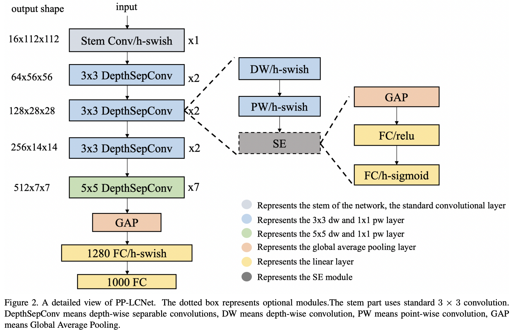

# pplcnet-pytorch

- [[arXiv:2109.15099](https://arxiv.org/pdf/2109.15099.pdf)], [[code](https://github.com/PaddlePaddle/PaddleClas)], [[AIWalker](https://mp.weixin.qq.com/s/4QJaRIGFYzQG9UHstsECgQ)]


PP-LCNet是百度提出的一种轻量型骨干网络，但它是采用PaddlePaddle实现的，而笔者使用最多的是Pytorch，故稍微花了点时间将其转换为pytorch版本。关于PP-LCNet的详细介绍可参考笔者之前的解读, 见上面的连接.



## Results


## 模型转换
> 注：paddle版code是从官方copy而来，torch版则是在此基础上简单调整得到。在转换之前记得先下载PaddlePaddle版的预训练模型哦。

这里提供了Paddle2Torch与Paddle2ONNX两种转换，当然也可以Torch2ONNX,但由于op转换方面的问题，这里仅保留了Paddle2ONNX版。

- Paddle2Torch
```
sh convert.sh
```

- Paddle2ONNX
```
sh toonnx.sh
```

